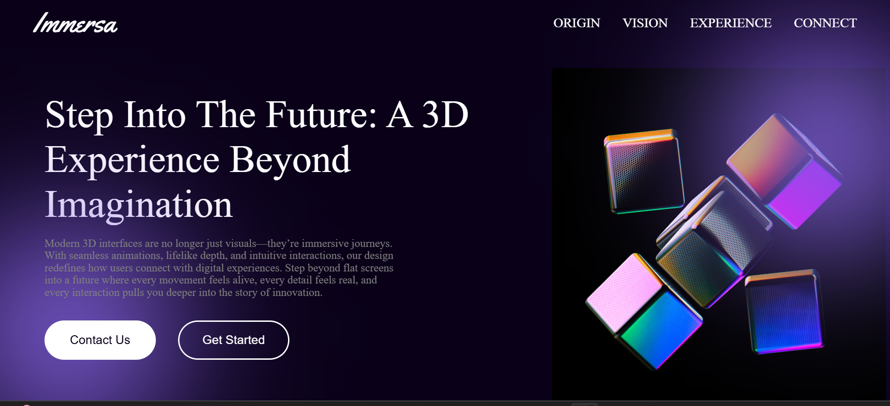

# Immersa 3D Landing 🚀  

A modern single-page 3D landing website built with **HTML, CSS, and JavaScript**, featuring an interactive **Spline 3D cubic design**.  
This project is purely **non-functional** (UI showcase only), created for learning, design practice, and portfolio demonstration.  

---

## 📸 Screenshot  

  


---

## ✨ Features  

- 🎨 Clean and modern UI design  
- 🖼️ 3D interactive cubic design using **Spline Embed**  
- 🌌 Futuristic gradient background effects  
- ⚡ Smooth button hover animations  

---

## 🛠️ Tech Stack  

- **HTML5** – Structure  
- **CSS3** – Styling & animations  
- **JavaScript** – Basic interactivity  
- **Spline** – For creating & embedding 3D design 

---

## 🙌 Credits

3D design created with Spline

Fonts from Google Fonts

Inspiration from modern 3D landing page concepts

---

## 💡 About Spline

As a fresher exploring modern web technologies, I found Spline to be an amazing tool for bringing 3D creativity into web projects.

🌟 It allows you to design 3D elements visually without needing deep 3D coding knowledge.

🔗 With its easy embed feature, it integrates seamlessly into HTML/CSS/JS projects.

🎓 For beginners and freshers like me, Spline makes it possible to create professional 3D effects that level up any portfolio project.

---

## 🚀 Live Demo  

👉 [View Demo]()
---

## 🖥️ Run Locally  

Clone the project: 

```bash
git clone https://github.com/vighnesh204/immersa-3d-landing.git
